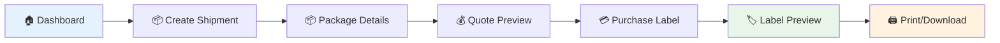
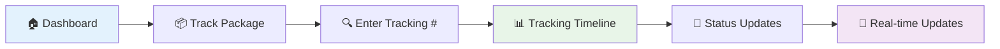
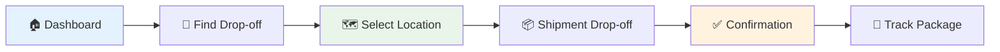
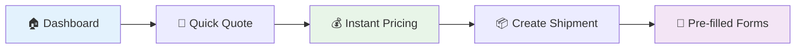
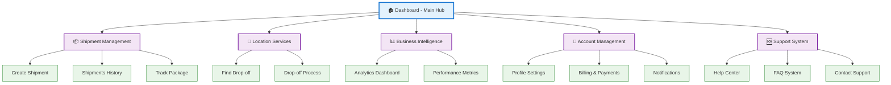

# Merchant Dashboard Visual Sitemap

## 🗺️ Navigation Structure Diagram

```mermaid
graph TD
    A[🏠 Landing Page /] --> B[🔐 Login /login]
    B --> C[🏠 Dashboard /dashboard]
    
    %% Main Dashboard Quick Actions
    C --> D[📦 Create Shipment /create-shipment]
    C --> E[📋 Shipments History /shipments]
    C --> F[📍 Find Drop-off /find-dropoff]
    C --> G[📊 Analytics /analytics]
    C --> H[👤 Profile /profile]
    C --> I[💰 Billing /billing]
    C --> J[🔔 Notifications /notifications]
    C --> K[🆘 Support /support]
    C --> L[📦 Track Package /track-package]
    
    %% Shipment Creation Flow
    D --> M[📦 Package Details /package-details]
    M --> N[💰 Quote Preview /quote-preview]
    N --> O[💳 Purchase Label /purchase-label]
    O --> P[🏷️ Label Preview /label/preview]
    
    %% Shipment Operations
    E --> Q[📦 Individual Shipment /shipments/[id]]
    
    %% Drop-off Flow
    F --> R[📦 Shipment Drop-off /shipment-dropoff]
    R --> S[✅ Drop-off Confirmation /dropoff-confirmation]
    S --> L
    
    %% Quick Quote Flow
    C --> T[🧮 Quick Quote Modal]
    T --> D
    
    %% Styling
    classDef dashboard fill:#e3f2fd,stroke:#1976d2,stroke-width:2px
    classDef shipment fill:#f3e5f5,stroke:#7b1fa2,stroke-width:2px
    classDef tracking fill:#e8f5e8,stroke:#388e3c,stroke-width:2px
    classDef management fill:#fff3e0,stroke:#f57c00,stroke-width:2px
    classDef support fill:#fce4ec,stroke:#c2185b,stroke-width:2px
    
    class C dashboard
    class D,M,N,O,P,Q shipment
    class F,R,S,L tracking
    class E,G,H,I management
    class J,K support
```

## 🔄 User Flow Diagrams

### 1. Shipment Creation Flow


### 2. Package Tracking Flow


### 3. Drop-off Process Flow


### 4. Quick Actions Flow


## 📱 Page Hierarchy



## 🎯 Navigation Patterns

### **Primary Navigation**
- **Dashboard** - Central hub with quick actions
- **Shipments** - Core business operations
- **Analytics** - Business intelligence
- **Profile** - Account management

### **Secondary Navigation**
- **Support** - Help and documentation
- **Notifications** - System updates
- **Billing** - Financial management

### **Contextual Navigation**
- **Breadcrumbs** - Page hierarchy
- **Back buttons** - Return to previous
- **Quick actions** - Direct access to common tasks

## 🔗 URL Structure

```
/                           # Landing page
/login                      # Authentication
/dashboard                  # Main merchant hub
/create-shipment           # New shipment wizard
/package-details           # Package specifications
/quote-preview             # Price calculation
/purchase-label            # Payment processing
/label/preview             # Label generation
/shipments                 # Shipment management
/shipments/[id]            # Individual shipment
/find-dropoff              # Location finder
/shipment-dropoff          # Drop-off process
/dropoff-confirmation      # Confirmation page
/track-package             # Package tracking
/billing                   # Financial management
/analytics                 # Business intelligence
/profile                   # Account settings
/notifications             # Notification center
/support                   # Help and support
```

## 📊 Page Status Overview

| Category | Pages | Status | Features |
|----------|-------|---------|----------|
| **Core Dashboard** | 1 | ✅ Complete | Quick actions, stats, navigation |
| **Shipment Management** | 6 | ✅ Complete | Creation, tracking, history |
| **Location Services** | 3 | ✅ Complete | Drop-off finder, process |
| **Business Intelligence** | 1 | ✅ Complete | Analytics, metrics |
| **Account Management** | 3 | ✅ Complete | Profile, billing, notifications |
| **Support System** | 1 | ✅ Complete | Help center, FAQ |

**Total: 15+ functional pages**  
**Status: 100% Complete**  
**Ready for: Backend Integration**
