# Merchant Dashboard - Remaining Pages User Flow Chart

```mermaid
graph TD
    %% Main Dashboard Entry Point
    A[Merchant Dashboard<br/>Main Hub] --> B{User Action}
    
    %% Analytics Flow
    B -->|View Analytics| C[Analytics Dashboard]
    C --> C1[Performance Metrics]
    C --> C2[Revenue Charts]
    C --> C3[Shipment Analytics]
    C --> C4[Export Reports]
    C --> C5[Date Range Filters]
    
    %% Profile Management Flow
    B -->|Manage Account| D[Profile & Account]
    D --> D1[Business Information]
    D --> D2[Account Settings]
    D --> D3[Password Change]
    D --> D4[Notification Preferences]
    D --> D5[API Keys & Integrations]
    
    %% Shipment Management Flow
    B -->|Manage Shipments| E[Shipment History]
    E --> E1[All Shipments Table]
    E --> E2[Filter by Status]
    E --> E3[Search Shipments]
    E --> E4[Bulk Operations]
    E --> E5[Shipment Details View]
    E --> E6[Re-ship Options]
    
    %% Notifications Flow
    B -->|View Notifications| F[Notifications Center]
    F --> F1[Unread Notifications]
    F --> F2[Mark as Read]
    F --> F3[Notification Settings]
    F --> F4[Delivery Alerts]
    F --> F5[System Updates]
    
    %% Billing Flow
    B -->|Manage Billing| G[Billing & Payments]
    G --> G1[Payment History]
    G --> G2[Download Invoices]
    G --> G3[Payment Methods]
    G --> G4[Billing Preferences]
    G --> G5[Tax Documents]
    
    %% Support Flow
    B -->|Get Help| H[Support & Help Center]
    H --> H1[FAQ Section]
    H --> H2[Help Articles]
    H --> H3[Contact Support]
    H --> H4[Live Chat]
    H --> H5[Video Tutorials]
    
    %% Navigation Back to Dashboard
    C --> A
    D --> A
    E --> A
    F --> A
    G --> A
    H --> A
    
    %% Quick Actions from Dashboard
    A -->|Quick Create| I[Create New Shipment]
    A -->|Quick Track| J[Track Package]
    A -->|Quick Analytics| C
    
    %% Styling
    classDef dashboard fill:#e3f2fd,stroke:#1976d2,stroke-width:2px
    classDef page fill:#f3e5f5,stroke:#7b1fa2,stroke-width:2px
    classDef feature fill:#e8f5e8,stroke:#388e3c,stroke-width:1px
    classDef action fill:#fff3e0,stroke:#f57c00,stroke-width:1px
    
    class A dashboard
    class C,D,E,F,G,H page
    class C1,C2,C3,C4,C5,D1,D2,D3,D4,D5,E1,E2,E3,E4,E5,E6,F1,F2,F3,F4,F5,G1,G2,G3,G4,G5,H1,H2,H3,H4,H5 feature
    class B,I,J action
```

## Page Descriptions & Features

### 📊 **Analytics Dashboard** (`/analytics`)
- **Performance Metrics**: Shipment success rates, delivery times, cost analysis
- **Revenue Charts**: Monthly/yearly revenue trends, profit margins
- **Shipment Analytics**: Geographic distribution, service type usage
- **Export Reports**: PDF/CSV export for business reporting
- **Date Range Filters**: Customizable time periods for analysis

### 👤 **Profile & Account** (`/profile`)
- **Business Information**: Company details, address, contact info
- **Account Settings**: Email preferences, language, timezone
- **Password Change**: Secure password management
- **Notification Preferences**: Email, SMS, push notification settings
- **API Keys & Integrations**: Third-party service connections

### 📦 **Shipment History** (`/shipments`)
- **All Shipments Table**: Complete shipment database with pagination
- **Filter by Status**: Pending, in-transit, delivered, failed
- **Search Shipments**: By tracking number, recipient, date
- **Bulk Operations**: Mass status updates, bulk label printing
- **Shipment Details View**: Full shipment information and timeline
- **Re-ship Options**: Duplicate successful shipments

### 🔔 **Notifications Center** (`/notifications`)
- **Unread Notifications**: Priority alerts and updates
- **Mark as Read**: Bulk notification management
- **Notification Settings**: Customize alert preferences
- **Delivery Alerts**: Real-time shipment status updates
- **System Updates**: Platform announcements and maintenance

### 💳 **Billing & Payments** (`/billing`)
- **Payment History**: Complete transaction log
- **Download Invoices**: PDF invoice generation
- **Payment Methods**: Credit cards, bank accounts, digital wallets
- **Billing Preferences**: Auto-pay, invoice frequency
- **Tax Documents**: Year-end tax summaries

### 🆘 **Support & Help Center** (`/support`)
- **FAQ Section**: Common questions and answers
- **Help Articles**: Detailed guides and tutorials
- **Contact Support**: Ticket system and live chat
- **Live Chat**: Real-time customer support
- **Video Tutorials**: Step-by-step platform guides

## Navigation Patterns

- **Breadcrumb Navigation**: Shows current location in the system
- **Quick Actions**: Dashboard shortcuts to frequently used features
- **Sidebar Navigation**: Persistent navigation menu
- **Back to Dashboard**: Consistent return path from all pages
- **Contextual Actions**: Page-specific action buttons and menus
